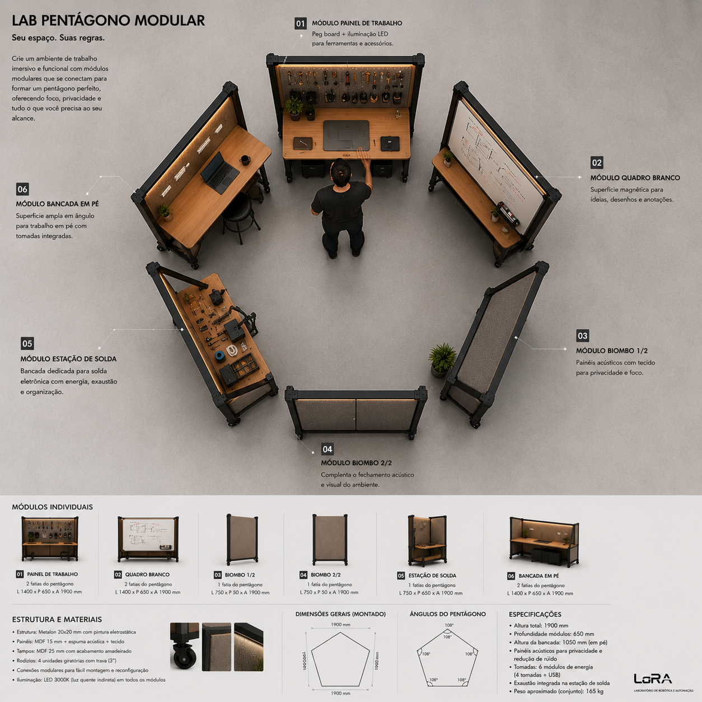
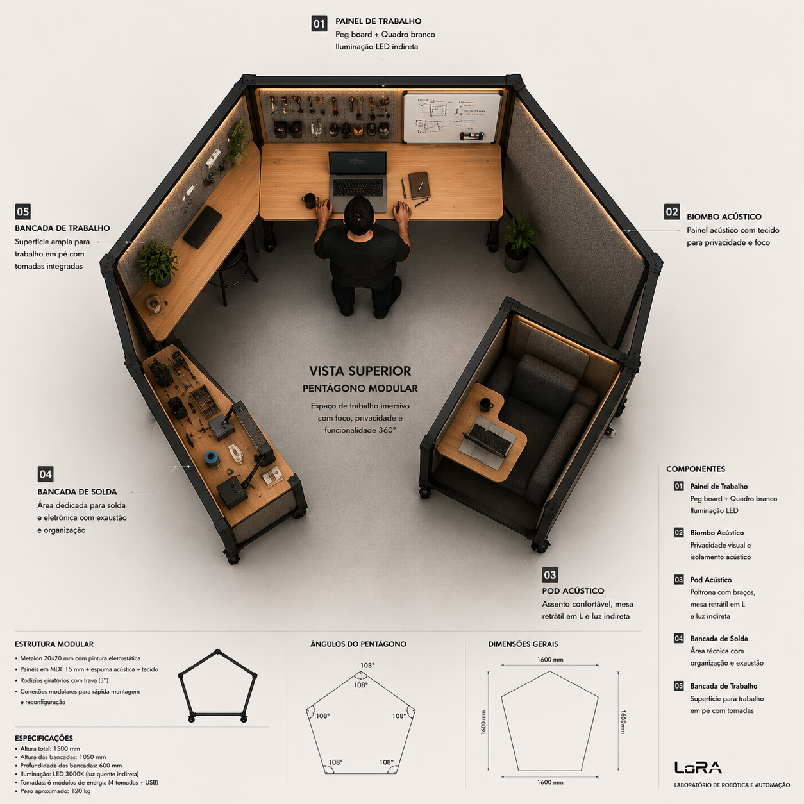

# Habitat

Open hardware designs for adaptive workspaces, modular workstations and experimental infrastructure for robotics and automation labs.

Developed by [LaRA](https://github.com/LaRA-UERJ) — Laboratório de Robótica e Automação, UERJ.

## Status

**Exploring.** This repository collects ideas, concepts, and references as options — no definitive design decisions yet. We're building understanding before committing to solutions.

## Philosophy

We're interested in workspaces as living systems — environments that adapt to people, tasks, and workflows, not the other way around. Key inspirations:

- **Robert Propst** — *The Office: A Facility Based on Change* (1968): workspaces should reconfigure as work changes
- **Bürolandschaft** — organic layouts based on information flow, not grids
- **OpenStructures** — interoperable modular grid systems
- **Open Source Ecology** — labs that build their own infrastructure
- **Cedric Price / Fun Palace** — fully reconfigurable spaces, nothing fixed

See [docs/concepts.md](docs/concepts.md) for a full catalog of philosophies presented as options.

## Active Projects

| Project | Description | Status |
|---|---|---|
| [Soldering Bench](designs/soldering-bench/) | Mobile standing bench for PCB soldering with pegboard, soldering iron, hot air, casters | Brief phase |
| [Workstation 120°](designs/workstation-120/) | Standing computer station with pegboard-mounted monitor, whiteboard, 120° angle, casters | Brief phase |
| [Partition 120°](designs/partition-120/) | Mobile 3-panel folding partition, steel frame, upholstered panels, acoustic + visual privacy, casters | Brief phase |
| [Break Pod](designs/break-pod/) | Mobile coffee and break station with countertop, open shelving, two counter stools, optional lower cabinet, casters | Brief phase |
| [Focus Pod](designs/focus-pod/) | Mobile semi-enclosed microenvironment for deep focus, calls, and silent work, with retractable L-desk, lounge chair, acoustic panels, casters | Brief phase |

## Design Principles Catalog

We're evaluating (not adopting) principles from multiple sources. See [docs/design-principles-catalog.md](docs/design-principles-catalog.md).

Highlights:
- 120° angles instead of 90°
- Postural variation (sit/stand/lean)
- Vertical surfaces as mental extension (pegboard, whiteboard)
- Gradual privacy (not binary open/closed)
- Task differentiation (different bench for different work)
- Radical adaptability (casters, modular frames, reconfigurable in hours)

## Modular Arrangements

All Habitat modules share the **120° principle**. This is not just a geometric preference — it enables modules to join into closed polygons, creating collective environments from individual, mobile pieces.

A module's edges are cut at 60° (half the 120° vertex angle), so when two modules meet at a corner, they form a clean 120° joint. This means any arrangement of modules at 120° closes naturally into a polygon.

### Hexagonal Focus Bay (6 modules)

The primary arrangement. Six modules at 120° form a hexagon — a semi-enclosed collective focus environment:

```
          ┌─────────────┐
         ╱               ╲
        ╱    Partition    ╲        ← Closure panel (acoustic + visual)
       ╱                   ╲
      │                     │
      │   Workstation 120°  │     ← Individual CAD/programming station
      │                     │
      │                     │
      │   Workstation 120°  │     ← Individual CAD/programming station
       ╲                   ╱
        ╲   Partition      ╱      ← Closure panel
         ╲               ╱
      ────┘             └────      ← Entrance (open, or low partition)
```

**Hybrid composition:**
- 2–3 sides: individual workstations (Workstation 120°) facing inward
- 2 sides: closure panels (Partition 120°) for acoustic and visual privacy
- 1 side: open entrance, or a low module (Break Pod, half-partition)

**Properties:**
- Creates a shared focus zone without walls or construction
- Each person has their own station but shares the enclosed environment
- Fully reconfigurable — disassemble and rearrange in minutes
- Naturally absorbs the 120° angle of each module — no custom joints needed
- Complementary to the Focus Pod: this is collective, the pod is individual

### Pentagon (5 modules, 108°)

Fewer modules, but requires module edges cut at 54° instead of 60° — a different geometry that doesn't align with the 120° principle. Explored as a concept (see reference images) but not the primary direction.





*Reference images illustrating the polygon arrangement concept. The images show pentagonal arrangements (108°) — the adopted direction is hexagonal (120°) to maintain alignment with the project's core geometry.*

### Module Roles in Arrangements

| Module | Role in Polygon | Notes |
|---|---|---|
| Workstation 120° | Active work side | Individual station facing inward |
| Partition 120° | Closure side | Acoustic + visual privacy |
| Break Pod | Entrance / social side | Low height, invites approach |
| Focus Pod | **Not part of arrangements** | Individual, separate, standalone |

### Implications for Module Design

For modules to join into polygons, each module needs:
- **Square-cut or 60°-cut edges** on the joining sides (exact approach TBD)
- **Consistent frame height** at the joint line so panels align
- **No protruding elements** (handles, casters, brackets) at the joint edges
- **Optional mechanical connection** — clips, magnets, or brackets to hold modules together

See [docs/layout-ideas.md](docs/layout-ideas.md) for detailed layout analysis.

**[Interactive Polygon Explorer →](https://lara-uerj.github.io/Habitat/tools/polygon-explorer.html)** — Adjust polygon, module size, bench depth, gaps, and person dimensions to visualize arrangements in scale.

## Layout Ideas

See [docs/layout-ideas.md](docs/layout-ideas.md) for spatial organization concepts, including a proposed layout for the LaRA 7×7m lab.

## References

All collected visual references, open-source projects, books, and videos: [docs/references.md](docs/references.md).

## License

Hardware designs: **CERN-OHL-S v2** (Strongly Reciprocal) — see [LICENSE](LICENSE).

Documentation and text: **CC BY-SA 4.0**.
