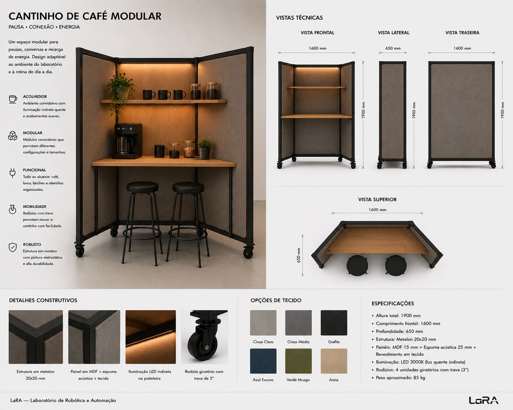

# Break Pod

Mobile coffee and break module for shared lab spaces. A compact, self-contained station that provides a ritual pause point — coffee, conversation, and informal collaboration — without requiring permanent infrastructure or plumbing.

---

## Brief

A free-standing, mobile break station inspired by coffee carts, kitchen islands, and micro-bars. The concept combines a countertop for a coffee machine, open shelving for cups and supplies, optional lower cabinet storage, and two stools — all on locking casters for reconfigurable lab architecture. The break pod is not just about coffee; it's about creating a intentional pause point in the workspace, a social node that encourages informal exchange and mental reset.

### Use Cases

- Coffee and tea preparation
- Informal conversations and quick syncs
- Mental reset between deep work sessions
- Hosting visitors with a coffee
- Water cooler moments in a lab context
- Snack and refreshment station

### Sensation

The pod should transmit:

- Warmth
- Informality
- Hospitality
- Shared ownership
- Pause / respite

A "casulo de pausa" — a coffee break cockpit, a social anchor in the lab.

---

## Requirements

- **Countertop surface** — Dedicated space for a coffee machine (espresso, drip, or pod-based), with enough depth for the machine + cups + preparation area
- **Open shelving** — At least one shelf above or behind the counter for cups, coffee, sugar, tea, and supplies. Visible and accessible — the supplies are part of the aesthetic, not hidden away
- **Two stools** — Compact counter-height stools (or stools that store under/around the pod) for sitting and chatting
- **Mobile (locking casters)** — Industrial black swivel casters with brakes. Same mobility language as the other pods
- **Optional lower cabinet** — Enclosed storage below the counter for bulk supplies, cleaning, waste bin. To be decided if included or kept minimal
- **Industrial clean aesthetic** — Consistent with the lab language: black matte steel frame, warm wood or laminate countertop, minimal hardware

---

## Design Options (Not Decided)

### Chassis

1. **Welded metalon frame** — 30×30 mm steel tubing, welded joints. Maximum rigidity, cleanest look. Non-disassemblable.
2. **Bolted metalon frame** — 30×30 mm tubing with bolted corner brackets. Disassembles for transport, no welding needed.
3. **Mixed frame (20×20 + 30×30)** — 30×30 for columns and base, 20×20 for shelf frames and secondary structure. Weight savings where possible.

### Lower Storage

1. **Open shelf** — Simple lower shelf, fully visible. Minimal, light, easy to build. No doors or drawers.
2. **Enclosed cabinet** — Doors (MDF or plywood) with magnetic catches. Hides clutter, stores bulk supplies and waste bin.
3. **Hybrid** — One side open shelf, one side cabinet. Best of both but more complex.
4. **No lower storage** — Countertop and upper shelf only, maximum visual lightness. Supplies stored elsewhere.

### Countertop

1. **Solid wood (hardwood)** — Warm, tactile, ages beautifully. Requires finishing (oil or varnish). Heavier.
2. **Plywood with hardwood edge** — Birch or pine plywood, exposed edge banding. Lab aesthetic, lighter, cheaper.
3. **Laminate (Formica)** — Durable, waterproof, easy to clean. Less character, more practical.
4. **Stainless steel** — Industrial kitchen aesthetic, ultra-durable, waterproof. Cold aesthetic but very practical for spills.

### Shelving

1. **Upper open shelf (fixed)** — Single shelf above/behind the counter. Simple, permanent.
2. **Multiple narrow shelves** — Stacked shelves at different heights for cups, supplies, decoration.
3. **Pegboard back panel** — Metalon + pegboard or slatwall behind counter. Hooks for cups, accessories. Consistent with other lab projects.
4. **Side shelf / wing** — Additional narrow surface extending to one side, for extra prep space or decoration.

---

## Dimensions (TBD)

| Dimension | Range | Notes |
|---|---|---|
| Overall width | 100–130 cm | Machine + shelf + prep area + stool clearance on sides |
| Overall depth | 50–65 cm | Counter depth, enough for machine + cups in front |
| Overall height | 90–110 cm | Counter height (~90 cm) + upper shelf or backsplash |
| Counter height | ~90 cm | Standard counter / bar height |
| Counter depth | ~50–60 cm | Machine depth + cup space |
| Upper shelf height | ~15–25 cm above counter | Accessible, not too high |
| Stool seat height | ~65 cm | Counter-height stool |

---

## Steel Frame Specs

| Component | Recommended | Tube | Rationale |
|---|---|---|---|
| Main columns | 1,5–2,0 mm | 30×30 mm | Primary structural members, support counter + machine + supplies |
| Base frame | 1,5–2,0 mm | 30×30 mm | Caster mounting points, stability base |
| Shelf frames | 1,0–1,5 mm | 20×20 mm | Lighter secondary structure for shelving |
| Counter support | 1,5 mm | 30×30 mm | Supports countertop + dynamic load (machine + water) |

**Finish:** Pintura eletrostática preta fosca microtexturizada (consistent with other pods)

---

## Stools

| Feature | Spec |
|---|---|
| Quantity | 2 |
| Style | Compact counter stool, industrial or minimalist |
| Seat height | ~65 cm |
| Material | Steel frame + wood seat, or all-steel |
| Storage | Can tuck against or under the pod when not in use |
| Integration | To be decided — integrated into frame or freestanding |

---

## Mobility

| Feature | Spec |
|---|---|
| Caster type | Industrial, black, swivel, with brake |
| Quantity | 4 (one per corner of base frame) |
| Diameter | 50–75 mm |
| Purpose | Pod moves to where it's needed — near workstations, in a corner, or against a wall |

---

## Optional Extras

### Water & Waste

- Galão de água embutido (5–10L) — gravity-fed or small pump
- Sistema de água ligado à rede (se posição fixa)
- Coletor de gotejamento / drip tray
- Lixeira embutida no armário inferior

### Electrical

- Tomada AC para máquina de café (110/220V)
- USB-C PD charging para celular enquanto toma café
- Iluminação indireta sob a prateleira (LED warm, 2700–3000K)

### Social

- Quadro negro / chalkboard em um dos lados para recados e mensagens
- Suporte para planta ou decoração
- Hook para aventais ou toalhas

---

## Reference Image

*Mobile break/coffee module with countertop for coffee machine, open shelving, two counter stools, and industrial casters.*

---

## Principles Being Evaluated

- [Everything on casters](../../docs/design-principles-catalog.md#everything-on-casters) — Mobile social infrastructure, reconfigurable in minutes
- [Task differentiation](../../docs/concepts.md#1-robert-propst--the-office-a-facility-based-on-change-1968) — A dedicated station for breaks, distinct from work zones
- [Walls as mental extension](../../docs/design-principles-catalog.md#walls-as-mental-extension) — Shelving and pegboard display supplies as part of the aesthetic
- [Gradual privacy](../../docs/design-principles-catalog.md#gradual-privacy-not-binary) — Semi-open, social posture — the opposite of the Focus Pod, a complementary social node
- [Postural variation](../../docs/design-principles-catalog.md#postural-variation) — Standing at counter + perched on stools — a break from seated work

---

## Name Candidates

Working names within the LaRA universe:

- **LaRA Break Pod**
- **LaRA Coffee Pod**
- **LaRA Brew Cart**
- **LaRA Pause Station**
- **LaRA Social Node**
- **LaRA Café Module**
- **LaRA Refuel Pod**

---

## Open Questions

- **Lower cabinet:** Enclosed storage, open shelf, or nothing at all?
- **Coffee machine:** Specific machine in mind? Dimensions and power requirements affect the design
- **Water supply:** Gravity-fed galão, plumbed, or manual fill?
- **Waste:** Integrated bin or separate?
- **Stools:** Integrated into frame or freestanding? Fixed or foldable?
- **Width:** Minimum viable width that feels comfortable for two people?
- **Countertop material:** Wood (warm) vs laminate (practical) vs steel (industrial)?
- **Pegboard:** Worth adding for cup hooks and accessory display?
- **Integration with other projects:** Share casters, frame joints, panel construction with Focus Pod and Partition 120°?
- **Position in lab:** Against wall or freestanding? Affects back panel design
- **Supplies capacity:** How many cups, how much coffee? Determines shelf sizing

---

## Files

| Path | Description |
|---|---|
| `cad/` | CAD files (.step, .FCStd) — to be added |
| `assets/reference-pod.png` | Reference image of the break pod concept |
