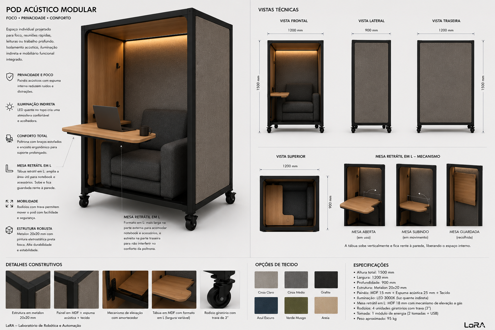

# Focus Pod

Mobile microenvironment for deep focus, calls, reading, and silent work. A semi-enclosed capsule that provides psychological comfort, partial isolation, and an industrial-lab aesthetic — without feeling like a corporate booth.

---

## Brief

A free-standing, mobile individual pod inspired by acoustic pods, reading nooks, Scandinavian booths, and micro-architecture. The concept combines comfort, acoustic damping, indirect lighting, a retractable L-shaped desk, and an integrated lounge chair — all on locking casters for reconfigurable lab architecture.

### Use Cases

- Deep coding / programming
- Video calls and meetings
- Reading datasheets and papers
- Quick rest / mental reset
- Brainstorming and sketching
- Silent concentrated work
- Personal retreat in a shared lab

### Sensation

The pod should transmit:

- Security
- Concentration
- Warmth
- Silence
- Introspection

Almost a "casulo de engenharia" — a human cockpit, a focus capsule.

---

## Requirements

- **Semi-enclosed format** — High side panels, partial ceiling, open front. Avoids claustrophobia, excessive heat, and "box" feeling while maintaining privacy and psychological protection
- **Mobile (locking casters)** — Industrial black swivel casters with brakes. Pod is reconfigurable architecture, not fixed furniture
- **Acoustic panels** — Layered construction: structural MDF + acoustic foam + optional acoustic blanket + tensioned fabric (30–50 mm total thickness)
- **Integrated lounge chair** — Armrests on both sides, dense foam, slightly reclined backrest, comfortable depth. Compact "mini cockpit" style
- **Retractable L-shaped desk** — Stores vertically against the side panel, opens forward when needed. Asymmetric L: wider outer section (notebook + mouse + coffee), narrower rear section (avoids hitting chair arm)
- **Indirect warm lighting** — Embedded LED strip (2700–3000K), hidden behind profile, with optional dimmer and presence sensor
- **Industrial clean aesthetic** — Black matte microtextured electrostatic paint on steel frame, warm fabric panels

---

## Design Options (Not Decided)

### Chassis

1. **Welded metalon frame** — 30×30 mm steel tubing, welded joints, maximum rigidity. Pros: strongest, cleanest welds. Cons: non-disassemblable, needs welding equipment.
2. **Bolted metalon frame** — 30×30 mm tubing with bolted corner brackets. Pros: disassembles for transport, no welding needed. Cons: more hardware visible, potential play at joints.
3. **Mixed frame (20×20 + 30×30)** — 30×30 for main structural members (columns, base), 20×20 for panel frames and ceiling structure. Pros: weight savings where less strength is needed. Cons: two tube sizes to source.

### Retractable Desk Mechanism

1. **Reinforced hinge + gas strut** — Desk folds down on heavy-duty hinge, gas strut (like car trunk lift) holds it open and controls closing speed. Pros: smooth, controlled motion. Cons: gas strut sizing critical.
2. **Articulated rail** — Desk slides and pivots on a rail system. Pros: compact storage, varied positions. Cons: more complex, potential play.
3. **Simple hinge + magnetic catch** — Basic hinge with magnetic lock in stored (vertical) position. Pros: simplest, cheapest. Cons: no damping on close, relies on user care.
4. **Scissor mechanism** — Desk folds in an X-pattern. Pros: very compact storage. Cons: complex, harder to build.

---

## Dimensions (TBD)

| Dimension | Range | Notes |
|---|---|---|
| Overall width | 90–110 cm | Wide enough for chair + desk, narrow enough for lab aisle |
| Overall depth | 80–100 cm | Chair depth + desk depth + clearance |
| Overall height | 180–200 cm | Above standing eye level, below ceiling (~280 cm) |
| Partial ceiling depth | 40–60 cm | Overhang at top — enough to mount light, not enough to feel enclosed |
| Panel height | 130–160 cm | Blocks sightlines when seated |
| Desk surface (outer) | 50–60 cm wide × 35–40 cm deep | Notebook + mouse + coffee |
| Desk surface (rear) | 25–30 cm wide × 20–25 cm deep | Narrow wing — avoids chair arm |
| Desk height | ~70–75 cm | Standard seated desk height |
| Chair seat height | ~42–45 cm | Lounge chair comfort |

---

## Steel Frame Specs

| Component | Recommended | Tube | Rationale |
|---|---|---|---|
| Main columns | 1,5–2,0 mm | 30×30 mm | Primary structural members, support chair + desk + person |
| Base frame | 1,5–2,0 mm | 30×30 mm | Caster mounting points, impact area |
| Panel frames | 1,0–1,5 mm | 20×20 mm | Lighter secondary structure for panel mounting |
| Ceiling structure | 1,0–1,2 mm | 20×20 mm | Minimal load, weight savings |
| Desk mount | 2,0 mm | 30×30 mm | Dynamic load from typing, leaning |

**Finish:** Pintura eletrostática preta fosca microtexturizada

---

## Panel Construction

| Layer | Material | Notes |
|---|---|---|
| Structural base | MDF 12–15 mm | Rigid panel substrate |
| Acoustic foam | Espuma acústica 15–25 mm | Medium density, sound absorption |
| Acoustic blanket (optional) | Manta acústica (lã PET reciclada ou melamina) | Additional absorption + thermal insulation |
| Outer fabric | Tecido tensionado (feltro, poliéster acústico, boucle, linho sintético) | Stretched and stapled or clipped to MDF |
| Total thickness | 30–50 mm | |

### Fabric Options

| Type | Character | Durability |
|---|---|---|
| Feltro premium | Warm, acoustic, matte | High |
| Poliéster acústico | Technical, clean | Very high |
| Boucle técnico | Textured, contemporary | Medium-high |
| Linho sintético | Light, elegant | Medium |

### Color Palette

- Grafite (dark gray)
- Areia (sand)
- Verde musgo (moss green)
- Azul petróleo (petrol blue)
- Cinza quente (warm gray)

---

## Retractable L-Shaped Desk

The desk is the most interesting mechanical element of the pod.

### Concept

- Stores vertically against the inner side panel
- Opens forward (rotates down) when needed
- Asymmetric L-shape:

```
        ┌──────────────┐  ← outer section (wider)
        │              │     notebook, mouse, coffee, tablet
        │              │
        ├──────┐       │
        │ rear │       │  ← rear section (narrower)
        │      │       │     avoids chair arm, ergonomic clearance
        └──────┴───────┘
```

### Mechanism Options

| Mechanism | Pros | Cons |
|---|---|---|
| Dobradiça reforçada + pistão a gás | Smooth motion, controlled close | Piston sizing critical |
| Trilho articulado | Compact, varied positions | Complex, potential play |
| Dobradiça simples + trava magnética | Simplest, cheapest | No damping |
| Mecanismo tesoura | Very compact storage | Complex build |

---

## Lounge Chair

| Feature | Spec |
|---|---|
| Style | Compact lounge / reading chair / "mini cockpit" |
| Armrests | Both sides |
| Foam | High density |
| Backrest | Slightly reclined (~105–110°) |
| Seat depth | Comfortable for extended sessions |
| Upholstery | Same fabric family as panels (visual coherence) |

---

## Lighting

| Feature | Spec |
|---|---|
| Type | Fita LED embutida (indirect) |
| Color temperature | 2700–3000K (warm) |
| Mounting | Hidden behind aluminum profile or panel edge |
| Control | Dimmer (rotary or touch) |
| Optional | Sensor de presença (auto on/off) |
| Optional | USB-C integrated in light profile |

---

## Mobility

| Feature | Spec |
|---|---|
| Caster type | Industrial, black, swivel, with brake |
| Quantity | 4 (one per corner of base frame) |
| Diameter | 50–75 mm |
| Purpose | Reconfigurable lab architecture — pod moves as needs change |

---

## Optional Extras

### Electrical

- Tomadas AC (110/220V)
- USB-C PD charging
- Carregador wireless embutido na mesa
- Iluminação RGB indireta (mood)

### Acoustic Upgrades

- Lã PET reciclada (eco-friendly acoustic absorption)
- Espuma melamínica (fire-retardant)
- Difusores acústicos internos (break up standing waves)

### Smart / IoT

- ESP32 or similar microcontroller
- Sensores mmWave (presence detection, more reliable than PIR)
- Home Assistant integration
- Sensors: presença, luminosidade, qualidade do ar (CO₂, VOC), temperatura, umidade
- Automated lighting and ventilation based on occupancy

---

## Reference Image



*Semi-enclosed mobile focus pod with acoustic panels, lounge chair, retractable L-desk, indirect lighting, and industrial casters.*

---

## Principles Being Evaluated

- [Gradual privacy](../docs/design-principles-catalog.md#gradual-privacy-not-binary) — High privacy zone: deep focus and calls, semi-enclosed but not claustrophobic
- [Everything on casters](../docs/design-principles-catalog.md#everything-on-casters) — Mobile architecture, reconfigurable in minutes
- [Noise gradient](../docs/design-principles-catalog.md#noise-gradient) — Acoustic isolation for the quietest zone in the lab
- [Postural variation](../docs/design-principles-catalog.md#postural-variation) — Lounge seating + desk surface = comfortable alternation
- [Task differentiation](../docs/concepts.md#1-robert-propst--the-office-a-facility-based-on-change-1968) — A dedicated space for focused individual work, distinct from collaborative benches
- [Walls as mental extension](../docs/design-principles-catalog.md#walls-as-mental-extension) — Panels define territory and reduce visual noise

---

## Name Candidates

Working names within the LaRA universe:

- **LaRA Focus Pod**
- **LaRA Nest**
- **LaRA Capsule**
- **LaRA Refuge**
- **LaRA Cocoon**
- **LaRA Booth**
- **LaRA Node**
- **LaRA QuietCell**
- **LaRA Deep Work Pod**

---

## Open Questions

- **Dimensions:** Final width/depth/height — needs to fit through standard doors (~80 cm) if moved between rooms?
- **Weight:** With metalon + MDF + foam + fabric + chair + casters — manageable by 1-2 people?
- **Stability:** High and narrow — anti-tip measures? Wider base than top? Weighted bottom?
- **Cost estimate:** Total BOM for one pod — viable for a university lab budget?
- **Fabricability:** Can the lab build this with available tools (welding, CNC, hand tools)?
- **Chair:** Off-the-shelf compact lounge chair modified to integrate, or custom upholstery from scratch?
- **Desk mechanism:** Which retractable mechanism to prototype first? Gas strut seems most promising
- **Ventilation:** Semi-enclosed with partial ceiling — does it need active ventilation for long sessions?
- **Panel attachment:** How do panels connect to the frame? Screws from inside? Quick-release clips?
- **Disassembly:** Should the pod be fully flat-packable or is semi-permanent assembly acceptable?
- **Acoustic performance:** Real NRC target? How much isolation is needed to make calls without disturbing others?
- **Name:** Which name to adopt?
- **Integration with other projects:** Can the pod share components (casters, panels, frame joints) with the Partition 120° and Workstation 120°?

---

## Files

| Path | Description |
|---|---|
| `cad/` | CAD files (.step, .FCStd) — to be added |
| `assets/reference-pod.png` | Reference image of the pod concept |
