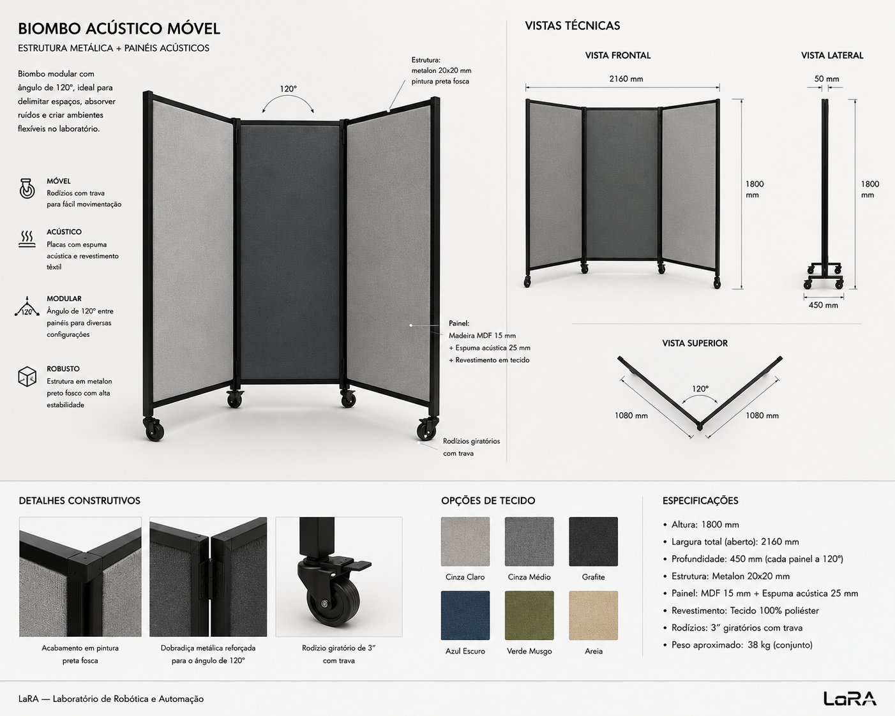

# Partition 120°

Mobile 3-panel folding partition with upholstered panels for acoustic separation and visual privacy in the lab.

---

## Brief

A free-standing folding screen (biombo) with three panels joined at 120° angles. Steel frame (metalón) with locking casters, upholstered panels (wood + foam + fabric) for sound absorption. Designed to create semi-enclosed zones in the 7×7m LaRA lab — separating noisy tasks (mechanical, CNC) from quiet tasks (CAD, reading) while maintaining visual permeability and reconfigurability.

---

## Requirements

- **3 panels, 2 folds at 120°** — Each adjacent pair meets at 120°, forming a gentle arc (~240° total sweep) that partially encloses without closing off
- **Steel frame (metalón)** — Square tubing (likely 25×25 or 30×30), welded or bolted, painted matte black
- **Locking casters on feet** — Mobile by design; brakes engaged when positioned
- **Upholstered panels** — Plywood or MDF base + acoustic foam + fabric covering, attached to frame
- **Dual function** — Acoustic damping (reduces noise transfer between lab zones) + visual privacy (creates focus areas without full walls)
- **Foldable for storage** — Panels fold flat when not in use

---

## Design Options (Not Decided)

1. **Welded steel frame + piano hinges** — Continuous hinge along the full height of each joint. Strong, simple. Pros: rigid, clean. Cons: non-disassemblable, hinge must be sized for 120° stop.

2. **Bolted steel frame + pin hinges** — Frame members bolted together with removable pin hinges at the joints. Pros: disassembles for transport/storage. Cons: more hardware, potential play at joints.

3. **Aluminum extrusion frame (4040 profile)** — Modular, T-slot accessories, no welding needed. Pros: infinitely adjustable, lab can modify later. Cons: significantly more expensive than welded steel.

---

## Dimensions (TBD)

| Dimension | Range | Notes |
|---|---|---|
| Panel width | 80–100 cm | Each of the 3 panels |
| Total height | 150–180 cm | Above seated eye level (~120 cm), below ceiling (~280 cm). ~160 cm is typical for acoustic screens |
| Panel thickness | 5–8 cm | Wood base (~12–15 mm) + foam (~30–50 mm) + fabric |
| Frame tube | 25×25 or 30×30 mm | Metalon quadrado — see Steel Frame Specs below |
| Caster diameter | 50–75 mm | With brake |

---

## Upholstered Panel Construction

| Layer | Material | Notes |
|---|---|---|
| Base | Compensado ou MDF 12–15 mm | Estrutura rígida do painel |
| Foam | Espuma acústica 30–50 mm densidade média | Absorção sonora + conforto visual |
| Fabric | Tecido acústico ou veludo | Lavável, resistente, cor escura (mancha menos) |
| Attachment | Parafusos pelo verso ou encaixe no frame | Painel removível para trocar tecido |

---

## Steel Frame Specs

Espessuras de metalon típicas para mobiliário (dados de mercado):

| Aplicação | Bitola (gauge) | Espessura | Uso |
|---|---|---|---|
| Leve / budget | 18–22 ga | 0,75–1,2 mm | Móveis baratos, arquivos |
| Intermediário | 16 ga | ~1,5 mm | Mesas de escritório, móveis comerciais |
| Profissional / pesado | 14 ga | ~2,0 mm | Standing desks, setups multi-monitor |
| Industrial | 12 ga | ~2,65 mm | Bancadas pesadas, frames estruturais |

### Recomendação para o biombo

O biombo é alto (~160 cm), estreito, com painéis estofados — precisa de rigidez mas não suporta cargas pesadas como uma mesa.

| Componente | Espessura recomendada | Tubo | Racional |
|---|---|---|---|
| Colunas verticais | **1,5 mm (16 ga)** | 25×25 ou 30×30 mm | Suficiente para rigidez sem excesso de peso |
| Travessas horizontais | 1,2–1,5 mm | 25×25 mm | Menos solicitação que as colunas |
| Base / pés | 1,5–2,0 mm | 30×30 mm | Área de impacto (rodízios, batidas) |

**Sweet spot:** tubo 30×30 com 1,5 mm — leve para mover, rígido o suficiente para não balançar. Para mais robustez: 30×30 com 2,0 mm (14 ga).

### Fontes

- Eureka Ergonomic: "Steel Gauge Guide" — https://eurekaergonomic.com/blogs/eureka-ergonomic-blog/steel-gauge-guide-gaming-desk-frame-thickness
- Jianglin Steel: "Steel Tube for Furniture" — https://jlinsteel.com/steel-tube-for-furniture
- Prolamsa USA: Furniture tubing specs — https://www.prolamsausa.com/furniture/

---

## Hinge / Joint Design

The 120° angle between panels needs hinges that either:
- **Stop at 120°** — Hinge with built-in stop (custom bracket or welding limit)
- **Allow 120° but can fold flat** — Hinge permits 0°–180° range; position held by a detent, chain, or magnetic catch

Options:
- Dobradiça de piano (full-length) com batente soldado a 120°
- Dobradiça com pino removível (parafuso ou pino quick-release)
- Articulação tipo livro com limitador angular

---

## Reference Image

*Three-panel folding partition: black metalón frame, locking casters, upholstered panels with wood + foam + fabric, 120° between panels.*

---

## Principles Being Evaluated

- [120° instead of 90°](../docs/design-principles-catalog.md#120-instead-of-90) — Core geometry; avoids harsh corners and dead spaces
- [Gradual privacy](../docs/design-principles-catalog.md#gradual-privacy-not-binary) — Medium privacy zone: blocks direct sightlines but preserves peripheral awareness
- [Everything on casters](../docs/design-principles-catalog.md#everything-on-casters) — Mobile partitions reconfigure the lab in minutes
- [Noise gradient](../docs/design-principles-catalog.md#noise-gradient) — Acoustic panels support the noise separation strategy between lab zones
- [Task differentiation](../docs/concepts.md#1-robert-propst--the-office-a-facility-based-on-change-1968) — Partitions help define distinct activity zones within the same room

---

## Open Questions

- **Tecido:** qual material? Veludo acústico, camurça, lona? Precisa ser lavável e resistente em lab com 30+ estudantes
- **Dobradiças:** tipo piano contínua ou pino removível? Precisa de batente a 120° ou liberdade total?
- **Base:** 2 ou 3 rodízios por painel? Com 3 painéis, o painel central pode ter 2 e os laterais 2 cada = 6 total
- **Estabilidade / anti-capotamento:** o biombo é alto (~160 cm) e estreito (~60 cm de profundidade). Precisa de base mais larga que o painel? Pé em L? Lastro na base?
- **Empilhável:** quando dobrado, pode ficar em pé encostado na parede? Precisa de suporte?
- **Acústica real:** quanta absorção o painel estofado realmente proporciona? Precisa de_teste ou dados de NRC (Noise Reduction Coefficient)?
- **Integração com bancadas:** o biombo pode servir como extensão da bancada de solda ou workstation 120°? Encaixa no sistema modular?
- **Cor do tecido:** escura (menos suja) ou clara (mais leve visualmente)? Padronizar ou permitir variação?
- **Painel de um lado só ou dos dois?** Estofado nos dois lados ou só no lado interno (lado do "fechamento")?
- **Peso total estimado:** com metalon + madeira + espuma + tecido + rodízios, quantos kg? Afeta mobilidade prática

---

## Files

| Path | Description |
|---|---|
| `cad/` | CAD files (.step, .FCStd) — to be added |
| `assets/reference-biombo.png` | Reference image of the partition concept |
