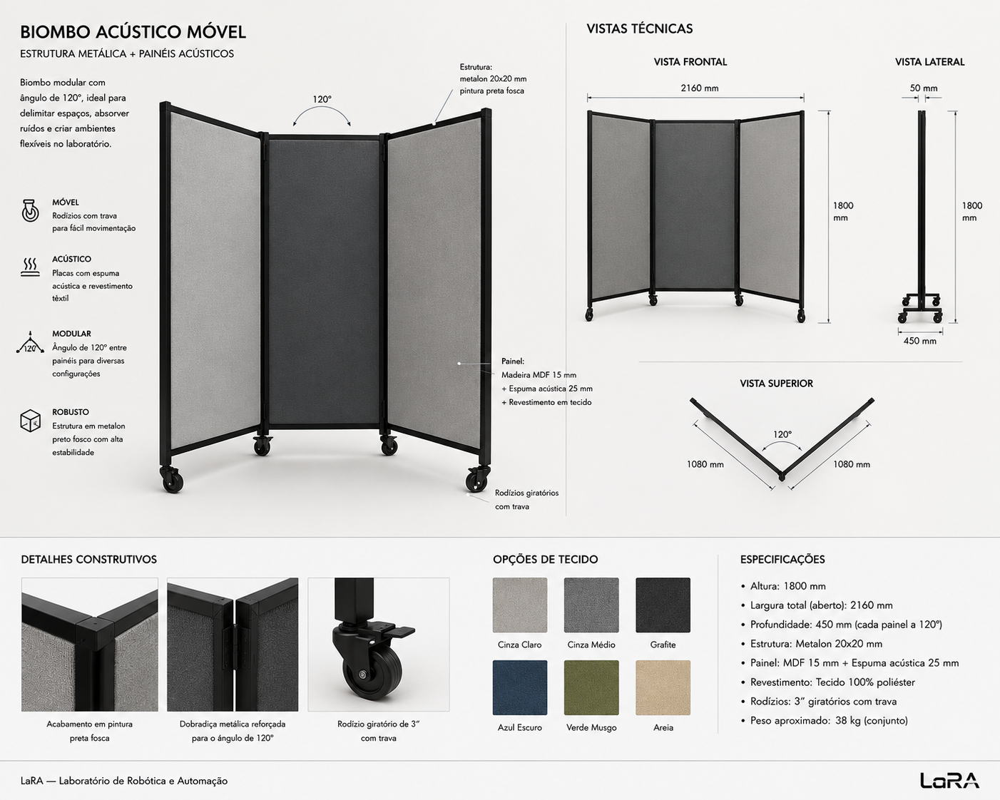

# Partition 120°

Mobile 3-panel folding partition with upholstered panels for acoustic separation and visual privacy in the lab.

---

## Brief

A free-standing folding screen (biombo) with three panels joined at 120° angles. Steel frame (metalón) with locking casters, upholstered panels (wood + foam + fabric) for sound absorption. Designed to create semi-enclosed zones in the 7×7m LaRA lab — separating noisy tasks (mechanical, CNC) from quiet tasks (CAD, reading) while maintaining visual permeability and reconfigurability.

---

## Requirements

- **3 panels, 2 folds at 120°** — Each adjacent pair meets at 120°, forming a gentle arc (~240° total sweep) that partially encloses without closing off
- **Steel frame (metalón)** — Square tubing (likely 25×25 or 30×30), welded or bolted, painted matte black
- **Locking casters on feet** — Mobile by design; brakes engaged when positioned
- **Upholstered panels** — Plywood or MDF base + acoustic foam + fabric covering, attached to frame
- **Dual function** — Acoustic damping (reduces noise transfer between lab zones) + visual privacy (creates focus areas without full walls)
- **Foldable for storage** — Panels fold flat when not in use

---

## Design Options (Not Decided)

1. **Welded steel frame + piano hinges** — Continuous hinge along the full height of each joint. Strong, simple. Pros: rigid, clean. Cons: non-disassemblable, hinge must be sized for 120° stop.

2. **Bolted steel frame + pin hinges** — Frame members bolted together with removable pin hinges at the joints. Pros: disassembles for transport/storage. Cons: more hardware, potential play at joints.

3. **Aluminum extrusion frame (4040 profile)** — Modular, T-slot accessories, no welding needed. Pros: infinitely adjustable, lab can modify later. Cons: significantly more expensive than welded steel.

---

## Dimensions

Brief ranges, with what the CAD has settled so far. See [`cad/README.md`](cad/README.md)
for the full parameter table and the open decisions.

| Dimension | Brief range | Settled in CAD | Notes |
|---|---|---|---|
| Panel width | 80–100 cm | **900 mm** | Each of the 3 panels |
| Total height | 150–180 cm | **1706 mm** (1600 frame + 102 caster + 4 base plate) | Com o rodízio comercial de 102 mm |
| Panel thickness | 5–8 cm | open | Wood base (~12–15 mm) + foam (~30–50 mm) + fabric |
| Frame tube | 25×25 or 30×30 mm | **30×30×1,5 mm** | Metalon quadrado — see Steel Frame Specs below |
| Caster diameter | 50–75 mm | **75 mm**, with brake | **4 units**, 2 per panel, only on the outer panels, inset 100 mm inside the panel plane |
| Base plate | — | **100 × 70 × 4 mm** welded under the bottom rail | 4 oblong slots 25 × 9 mm for the caster bolts |

Derived from the CAD: passo 1 (estrutura) 1358 × 1561 mm de planta, 14,64 m de tubo,
19,65 kg de aço. Passo 1b (base decidida): envoltória 1357,5 × 1560,9 × 1706 mm, 14,64 m de
tubo, 19,65 kg de tubo + 0,88 kg de chapas, 4 rodízios, margem de tombamento de 179,9 mm
(tomba a 11,62°; com 6 rodízios era 16,7°).

---

## Upholstered Panel Construction

| Layer | Material | Notes |
|---|---|---|
| Base | Compensado ou MDF 12–15 mm | Estrutura rígida do painel |
| Foam | Espuma acústica 30–50 mm densidade média | Absorção sonora + conforto visual |
| Fabric | Tecido acústico ou veludo | Lavável, resistente, cor escura (mancha menos) |
| Attachment | Parafusos pelo verso ou encaixe no frame | Painel removível para trocar tecido |

---

## Steel Frame Specs

Espessuras de metalon típicas para mobiliário (dados de mercado):

| Aplicação | Bitola (gauge) | Espessura | Uso |
|---|---|---|---|
| Leve / budget | 18–22 ga | 0,75–1,2 mm | Móveis baratos, arquivos |
| Intermediário | 16 ga | ~1,5 mm | Mesas de escritório, móveis comerciais |
| Profissional / pesado | 14 ga | ~2,0 mm | Standing desks, setups multi-monitor |
| Industrial | 12 ga | ~2,65 mm | Bancadas pesadas, frames estruturais |

### Recomendação para o biombo

O biombo é alto (~160 cm), estreito, com painéis estofados — precisa de rigidez mas não suporta cargas pesadas como uma mesa.

| Componente | Espessura recomendada | Tubo | Racional |
|---|---|---|---|
| Colunas verticais | **1,5 mm (16 ga)** | 25×25 ou 30×30 mm | Suficiente para rigidez sem excesso de peso |
| Travessas horizontais | 1,2–1,5 mm | 25×25 mm | Menos solicitação que as colunas |
| Base / pés | 1,5–2,0 mm | 30×30 mm | Área de impacto (rodízios, batidas) |

**Sweet spot:** tubo 30×30 com 1,5 mm — leve para mover, rígido o suficiente para não balançar. Para mais robustez: 30×30 com 2,0 mm (14 ga).

### Fontes

- Eureka Ergonomic: "Steel Gauge Guide" — https://eurekaergonomic.com/blogs/eureka-ergonomic-blog/steel-gauge-guide-gaming-desk-frame-thickness
- Jianglin Steel: "Steel Tube for Furniture" — https://jlinsteel.com/steel-tube-for-furniture
- Prolamsa USA: Furniture tubing specs — https://www.prolamsausa.com/furniture/

---

## Hinge / Joint Design

The 120° angle between panels needs hinges that either:
- **Stop at 120°** — Hinge with built-in stop (custom bracket or welding limit)
- **Allow 120° but can fold flat** — Hinge permits 0°–180° range; position held by a detent, chain, or magnetic catch

Options:
- Dobradiça de piano (full-length) com batente soldado a 120°
- Dobradiça com pino removível (parafuso ou pino quick-release)
- Articulação tipo livro com limitador angular

---

## Reference Image

*Three-panel folding partition: black metalón frame, locking casters, upholstered panels with wood + foam + fabric, 120° between panels.*

---

## Principles Being Evaluated

- [120° instead of 90°](../../docs/design-principles-catalog.md#120-instead-of-90) — Core geometry; avoids harsh corners and dead spaces
- [Gradual privacy](../../docs/design-principles-catalog.md#gradual-privacy-not-binary) — Medium privacy zone: blocks direct sightlines but preserves peripheral awareness
- [Everything on casters](../../docs/design-principles-catalog.md#everything-on-casters) — Mobile partitions reconfigure the lab in minutes
- [Noise gradient](../../docs/design-principles-catalog.md#noise-gradient) — Acoustic panels support the noise separation strategy between lab zones
- [Task differentiation](../../docs/concepts.md#1-robert-propst--the-office-a-facility-based-on-change-1968) — Partitions help define distinct activity zones within the same room

---

## Open Questions

- **Tecido:** qual material? Veludo acústico, camurça, lona? Precisa ser lavável e resistente em lab com 30+ estudantes
- **Dobradiças:** tipo piano contínua ou pino removível? Precisa de batente a 120° ou liberdade total?
- **Base:** resolvido — 4 rodízios, 2 por folha, só nas folhas das pontas, recuados 100 mm
  dentro do plano da folha (o pé em L foi descartado: risco de tropeço no lab)
- **Estabilidade / anti-capotamento:** resolvido no passo 1b — sem base alargada. Medido no
  modelo: margem de tombamento de 179,9 mm (11,62°) com 4 rodízios; era 16,7° com 6. O número
  final ainda cai quando o painel estofado (passo 2) entrar no CG
- **Empilhável:** quando dobrado, pode ficar em pé encostado na parede? Precisa de suporte?
- **Acústica real:** quanta absorção o painel estofado realmente proporciona? Precisa de_teste ou dados de NRC (Noise Reduction Coefficient)?
- **Integração com bancadas:** o biombo pode servir como extensão da bancada de solda ou workstation 120°? Encaixa no sistema modular?
- **Cor do tecido:** escura (menos suja) ou clara (mais leve visualmente)? Padronizar ou permitir variação?
- **Painel de um lado só ou dos dois?** Estofado nos dois lados ou só no lado interno (lado do "fechamento")?
- **Peso total estimado:** com metalon + madeira + espuma + tecido + rodízios, quantos kg? Afeta mobilidade prática

---

## CAD

Passo 1 (estrutura de metal) e passo 1b (base: rodízio comercial + pé em L), gerados por
script headless. Ver [`cad/README.md`](cad/README.md) para regenerar e para as pendências.

| Artefato | O que é |
|---|---|
| [`cad/saida/passo1_prancha.pdf`](cad/saida/passo1_prancha.pdf) | Prancha A3 cotada do passo 1 — estrutura |
| [`cad/saida/passo1_biombo.step`](cad/saida/passo1_biombo.step) | Sólido do passo 1 |
| [`cad/saida/passo1_lista_corte.csv`](cad/saida/passo1_lista_corte.csv) | Lista de corte do passo 1 |
| [`cad/saida/passo1b_prancha.pdf`](cad/saida/passo1b_prancha.pdf) | **Prancha A3 do passo 1b** — frente perpendicular à folha central, lateral paralela às folhas das pontas, planta, isométrica e detalhe da base em 1:2 |
| [`cad/saida/passo1b_prancha.dxf`](cad/saida/passo1b_prancha.dxf) | Geometria em mm para CAD |
| [`cad/saida/passo1b_biombo.step`](cad/saida/passo1b_biombo.step) | Sólido do passo 1b |
| [`cad/saida/passo1b_lista_corte.csv`](cad/saida/passo1b_lista_corte.csv) | Lista de corte: tubo, chapa e rodízio |

O que já está fechado: metalon 30×30×1,5 mm, folha de 900 × 1600 mm, 120° internos entre
folhas (giro de 60° por junta), rodízio moveleiro Ø75 com freio de altura 102 mm e carga
70 kg, **4 rodízios** (2 por folha, só nas folhas das pontas, recuados 100 mm dentro do plano
da folha), chapa soldada 100 × 70 × 4 mm com 4 rasgos oblongos sob cada rodízio, altura total
1706 mm, 14,64 m de tubo e margem de tombamento de 179,9 mm (11,62°).

O que ainda não existe: painel estofado (compensado + espuma + tecido), dobradiças, e a
confirmação do passo entre os furos da chapa (medir o rodízio comprado antes de furar).
Ver [`cad/README.md`](cad/README.md#pendências).

## Files

| Path | Description |
|---|---|
| `cad/` | Script de geração + `saida/` com prancha, DXF, STEP e lista de corte |
| `assets/reference-biombo.png` | Reference image of the partition concept |
