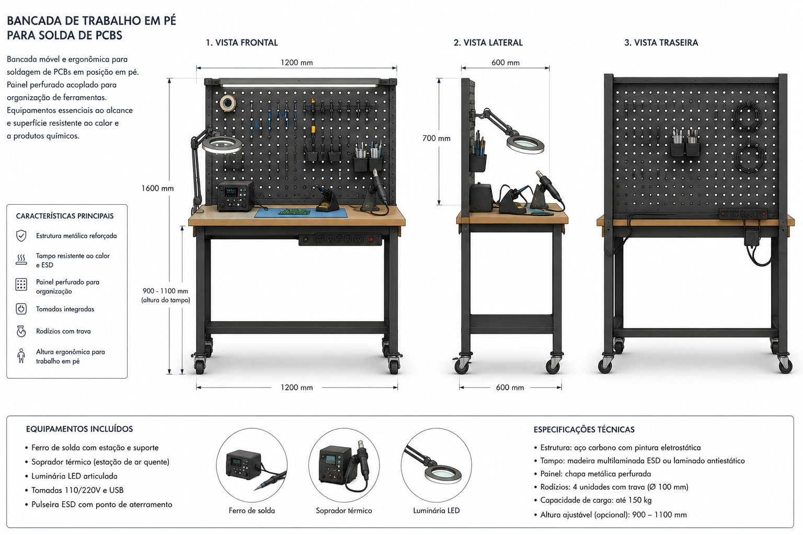

# Soldering Bench

Mobile standing bench for PCB soldering, rework, and electronics assembly.

---

## Brief

A self-contained workbench for soldering and electronics rework that can be moved around the lab. Designed for standing work with integrated tool storage via a perforated pegboard panel.

### Requirements

- **Standing height work surface** — Optimized for precision soldering while standing (approximately elbow height)
- **Integrated pegboard panel** — Perforated panel attached to the bench for hanging tools (soldering iron, hot air station, probes, tweezers, wire cutters)
- **Soldering iron holder** — Fixed mount on the bench or pegboard for soldering iron, accessible without reaching
- **Hot air station mount** — Space for hot air rework station on the bench surface
- **Mobile (casters)** — Casters with brakes for repositioning. Bench must be stable when brakes are engaged
- **ESD-safe** — Grounded work surface (ESD mat) and grounding point for wrist strap

### Design Options (Not Decided)

1. **Aluminum extrusion frame (V-slot 4040 or 2040)** — Modular, reconfigurable, clean industrial look. Pegboard mounts with T-slot brackets. Pros: infinitely adjustable. Cons: cost, visible hardware.
2. **Plywood + steel frame** — Birch plywood panels on welded or bolted steel frame. Warmer aesthetic. Pros: cheaper, quieter acoustically. Cons: harder to modify once built.
3. **All-plywood CNC-cut** — Flat-pack design cut on the lab's CNC. Inspired by OpenStructures grid. Pros: the lab builds its own bench. Cons: structural limitations of plywood-only.

### Dimensions (TBD)

- Width: ~100–120 cm
- Depth: ~60–80 cm
- Height: ~95–105 cm (standing work)
- Pegboard height: ~40–60 cm above work surface

### Equipment Integration

| Equipment | Mounting | Notes |
|---|---|---|
| Soldering iron | Pegboard mount or bench bracket | Within arm's reach, tip holder nearby |
| Hot air station | Bench surface, right side | Needs power outlet |
| Multimeter | Pegboard hook or small shelf | Frequently used, must be accessible |
| Oscilloscope | Bench surface (if needed) | May live on shared cart instead |
| Flux, solder, tips | Small bins on pegboard | Consumables — labeled, restocked |
| ESD mat | Full work surface | Grounded to bench frame |
| Fume extractor | Bench-mounted or overhead | Important for solder fumes |
| Power strip | Under-bench mount | Multiple outlets for iron + hot air + lamp |
| Task light | Pegboard or overhead arm | Diffused, adjustable, no shadow on work |

### Reference Images

### Concept Render

*Mobile standing bench with pegboard panel, soldering iron, hot air station, and casters.*

### Principles Being Evaluated

- [Postural variation](../docs/design-principles-catalog.md#postural-variation) — Standing-only for this bench
- [Everything on casters](../docs/design-principles-catalog.md#everything-on-casters) — Mobile by requirement
- [Vertical surfaces as mental extension](../docs/design-principles-catalog.md#walls-as-mental-extension) — Pegboard as tool display + shadow board
- [Task differentiation](../docs/concepts.md#1-robert-propst--the-office-a-facility-based-on-change-1968) — This bench is only for soldering/rework, not general workspace

### Open Questions

- Cable management for soldering iron, hot air, and lamp when bench is mobile
- Fume extraction: integrated or separate portable unit?
- Storage underneath: open shelf, drawer, or closed cabinet?
- Weight budget: how heavy can the loaded bench be before casters become impractical?

---

## Files

| Path | Description |
|---|---|
| `cad/` | CAD files (.step, .FCStd) — to be added |
| `assets/` | Reference images and renders — to be added |
