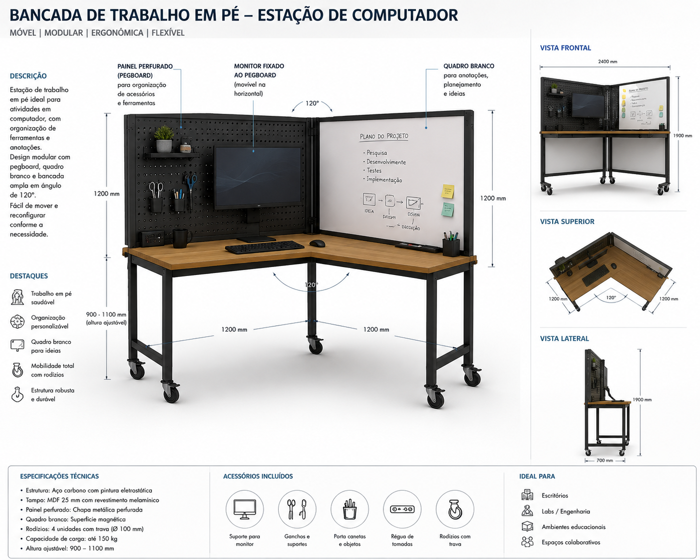

# Workstation 120°

Standing/sitting computer station with pegboard-mounted monitor, whiteboard, and 120° angle, on casters.

---

## Brief

A modular workstation for CAD, programming, and documentation work. The key feature is a 120° angle between the computer surface and an adjacent whiteboard, creating a semi-enclosed "bay" that supports both screen work and spontaneous sketching/diagramming.

### Requirements

- **120° angle** — Between the computer desk surface and the whiteboard panel, forming a natural work bay
- **Monitor mounted on pegboard** — Monitor arm or VESA mount attached to a pegboard panel (not the desk), keeping the desk surface clear
- **Whiteboard panel** — Adjacent surface at 120° for sketching circuits, diagrams, equations, planning
- **Casters on feet** — Mobile station that can be repositioned in the lab
- **Keyboard/mouse surface** — At desk height (~72-75 cm seated, or adjustable)
- **Chair-compatible** — Allow both standing and seated use (adjustable height or stool option)

### Design Options (Not Decided)

1. **Aluminum extrusion frame with 120° bracket** — Two profile sections meeting at 120° with a custom bracket. Pegboard on one side, whiteboard on the other. Monitor arm on T-slot. Pros: clean, adjustable, industrial. Cons: custom bracket complexity.
2. **Plywood panels with CNC-cut 120° joint** — Two plywood panels joined at 120° with a finger joint or bracket cut on CNC. Lighter, warmer. Pros: lab can fabricate it. Cons: less adjustable once built.
3. **Separate modules** — Desk module + whiteboard module + pegboard module, each independent, connected at 120° via a shared base. Pros: can separate into individual units. Cons: alignment and rigidity.

### Dimensions (TBD)

- Total width (both wings): ~150–180 cm (across the 120° V)
- Computer desk depth: ~60–70 cm
- Whiteboard height: ~90–120 cm
- Overall height: ~120–150 cm (pegboard above desk level)
- Footprint: ~120 cm deep × 150 cm wide (projected)

### Equipment Integration

| Equipment | Mounting | Notes |
|---|---|---|
| Monitor (24-27") | Pegboard VESA mount or arm | Off the desk surface |
| Keyboard + mouse | Desk surface or tray | Pull-out tray saves space |
| Laptop (if used) | Desk surface or stand | Alternative to desktop monitor |
| Whiteboard | Panel at 120° | Magnetic whiteboard — markers + eraser nearby |
| Pegboard | Behind/above monitor | Small shelves, hooks for accessories |
| Task light | Pegboard or overhead | Adjustable arm, avoids monitor glare |
| Power | Under-desk power strip | For laptop/monitor/charger |
| Cable management | Along frame or under desk | Important for mobile station |

### 120° Angle Rationale

From [Propst's principles](../docs/design-principles-catalog.md#120-instead-of-90):
- 120° creates a partial enclosure without feeling confined
- Preserves peripheral vision — awareness of the lab
- Natural entry/exit flow — not backing into a corner
- Two surfaces (screen + whiteboard) visible with a head turn, not a walk
- Better for collaborative pair work than a flat desk against a wall

### Reference Images

### Concept Render

*Standing computer station at 120° with pegboard-mounted monitor, whiteboard panel, and casters.*

### Principles Being Evaluated

- [120° instead of 90°](../docs/design-principles-catalog.md#120-instead-of-90) — Core design feature
- [Vertical surfaces as mental extension](../docs/design-principles-catalog.md#walls-as-mental-extension) — Whiteboard as working memory
- [Postural variation](../docs/design-principles-catalog.md#postural-variation) — Should support both sitting and standing
- [Everything on casters](../docs/design-principles-catalog.md#everything-on-casters) — Mobile by requirement
- [Gradual privacy](../docs/design-principles-catalog.md#gradual-privacy-not-binary) — 120° bay provides medium privacy for focused CAD work

### Open Questions

- Adjustable height (sit/stand): linear actuator, manual pin-lock, or fixed compromise height?
- How to keep the whiteboard clean in a shared environment (markers walk away)
- Storage: where do keyboard, mouse, laptop go when not in use?
- If two of these are placed facing each other, does the 120° create a good collaboration bay?
- Weight: monitor + whiteboard + pegboard can be top-heavy — stability concern with casters

---

## Files

| Path | Description |
|---|---|
| `cad/` | CAD files (.step, .FCStd) — to be added |
| `assets/` | Reference images and renders — to be added |
