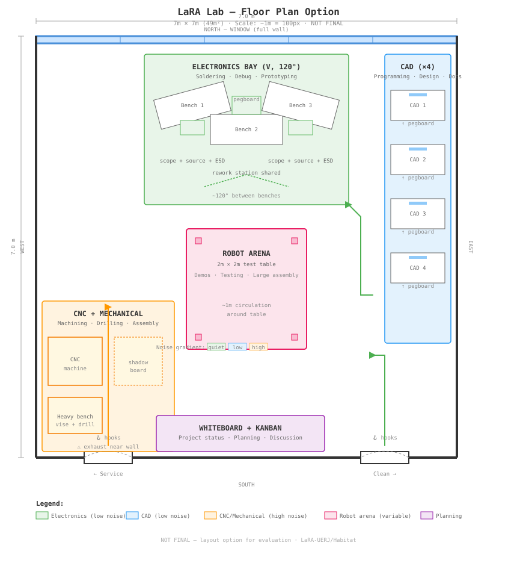

# Layout Ideas

Spatial organization concepts for the LaRA lab. All options — no decisions made.

---

## LaRA Lab — 7×7m Layout Option

### Constraints

- **Room:** 7m × 7m (49m²)
- **North wall:** Full window (entire wall)
- **South wall:** 2 doors — one at far left (southwest), one at far right (southeast)
- **East and west walls:** Solid, full-height
- **Equipment:** CNC machine + heavy bench (stays fixed), 2×2m robot test table (center)
- **3D printers:** Located in another room (fumes/odor)

### Layout Proposal

**Zoning logic:**
- Perimeter = productive zones (benches against walls)
- Center = robot test table (2×2m) with ~1m circulation on each side
- Noise gradient: quiet (north, window) → medium (east) → loud (southwest, CNC)

**Zones:**

| Zone | Location | Activity | Noise |
|---|---|---|---|
| Electronics bay (V, 120°) | North (window) | Soldering, debug, prototyping | Low–Medium |
| CAD stations (×4) | East wall | Programming, CAD, documentation | Low |
| CNC + heavy bench | Southwest corner | Machining, drilling, assembly | High |
| Whiteboard + Kanban | South wall (between doors) | Planning, project status | — |
| Robot test table (2×2m) | Center | Robot testing, demos, assembly | Variable |

**Circulation:**
- Right door (southeast) = clean entry → CAD, electronics
- Left door (southwest) = service entry → CNC, material in/out
- U-shaped flow around the central table

### Floor Plan (SVG)

---

## Layout Variations to Explore

### Option A: Propst-Style 120° Clusters

Three electronics benches in a 120° V-formation near the window, forming a collaborative bay. CAD stations along the east wall with whiteboard panels between them. CNC isolated in the southwest corner.

**Pros:** Applies 120° principle directly. Natural collaboration bays.
**Cons:** 120° uses more floor area per station. Tight fit in 49m².

### Option B: Bürolandschaft Organic

No straight lines. Benches arranged organically based on communication flow between research groups. Plants as dividers. Curved circulation paths.

**Pros:** More human, more interesting visually.
**Cons:** Harder to plan. Needs workflow study first. Less predictable density.

### Option C: Grid + Modular (OpenStructures)

Define a 40×40cm or 60×60cm grid for the entire lab. All benches, shelves, and panels align to the grid. Easy to reconfigure. Everything interoperable.

**Pros:** Maximum flexibility and interoperability.
**Cons:** Constrains design. Can feel rigid despite being modular.

### Option D: Activity-Based Zones

Divide the lab into named zones by activity, not by equipment. Zones: "Focus" (CAD), "Precision" (electronics), "Fabrication" (CNC), "Test" (robot table), "Plan" (whiteboard). Each zone optimized for its activity.

**Pros:** Clear purpose for each area. Easy to explain to new students.
**Cons:** Zones may conflict when multiple activities need the same space.

### Option E: Hexagonal Focus Bay

Six Habitat modules arranged in a hexagon, forming a semi-enclosed collective focus environment. Each module's edges are cut at 60° so that adjacent modules meet at 120° — the project's core angle.

**Composition (hybrid):**

| Side | Module | Facing | Function |
|---|---|---|---|
| 1 | Workstation 120° | Inward | Individual CAD/programming station |
| 2 | Workstation 120° | Inward | Individual CAD/programming station |
| 3 | Workstation 120° (or Partition) | Inward / closure | Station or acoustic panel |
| 4 | Partition 120° | Inward | Acoustic + visual closure |
| 5 | Partition 120° | Inward | Acoustic + visual closure |
| 6 | Open (entrance) | — | No module, or low partition / Break Pod |

**Geometry:**
- Internal angle: 120° at each vertex
- Estimated internal diameter: ~2.5–3m (depends on module width)
- Module edge cut angle: 60° (half of 120° vertex)
- Footprint: ~7–9m² (fits within the 49m² lab)

**Properties:**
- Creates a shared focus zone without walls or construction
- Each person has their own station but shares the enclosed environment
- Fully reconfigurable — disassemble into individual modules and rearrange in minutes
- Complementary to the Focus Pod (individual) — this is the collective equivalent
- Naturally absorbs the 120° angle of each module — no custom joints or adapters

**Pros:** Applies 120° principle at room scale. Modular — assemble and disassemble as needed. Creates strong collective focus without construction.
**Cons:** Requires 6 modules minimum. Occupies significant floor area. Module edges need specific cut angles for clean joints. Cable management for workstations inside the bay needs a solution.

**Implications for module design:**
- Modules need clean edges at 60° cuts on the joining sides
- Consistent frame height at the joint line for alignment
- No protruding elements (handles, casters) at joint edges
- Optional mechanical connection (clips, magnets, brackets) between modules

**Pentagon alternative (5 modules, 108°):**
Fewer modules needed, but 108° doesn't align with the 120° principle. Would require module edges cut at 54° — a different geometry. Explored as a concept but hexagon is the primary direction. See reference images in the main README.

---

## Lessons from History

From the office design evolution video and Propst's work:

1. **Design for the task, not the ideology** — Don't build an "open lab" or a "modern lab." Build for what people actually do.
2. **Observe before designing** — Watch how the lab works now. Where do people gravitate? Where are the bottlenecks? Layout should follow behavior.
3. **The Propst trap** — Good modular design gets frozen into rigid layouts by cost/effort pressure. Build in explicit reconfiguration rituals (monthly layout review?).
4. **The Harvard study finding** — Open plans reduce face-to-face communication, not increase it. Partial enclosure (120° panels, semi-private bays) actually encourages collaboration more than full openness.

---

## Planning Resources

### Search Terms for Floor Plans
- `robotics lab floor plan`
- `university makerspace layout`
- `FabLab floor plan`
- `electronics lab workbench layout`
- `activity based working floor plan`

### Tools for Drawing
- **FreeCAD** — Arch workbench for 2D floor plans
- **Sweet Home 3D** — Quick residential-scale layout tool
- **LibreCAD** — 2D-only CAD, good for floor plans
- **Draw.io / diagrams.net** — Quick schematic layouts, not to scale
- **SVG** — Direct authoring (what we'll use for initial concepts)
- **Inkscape** — SVG editor for refining floor plans
